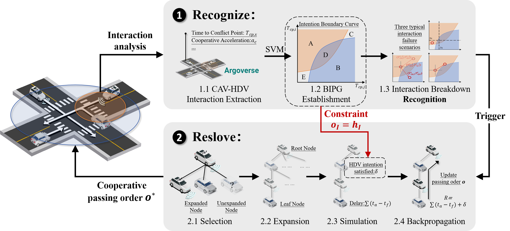
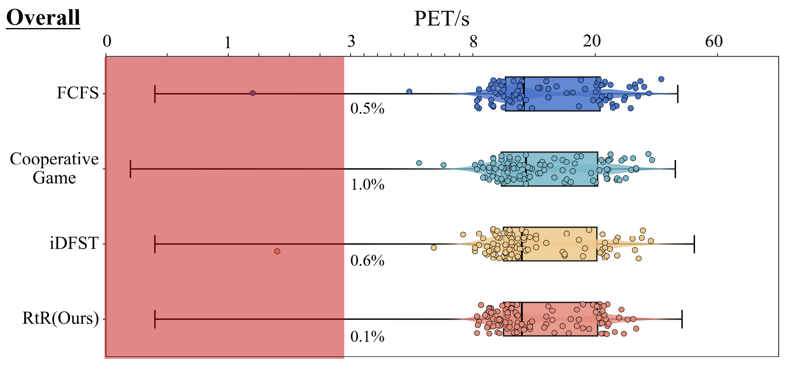
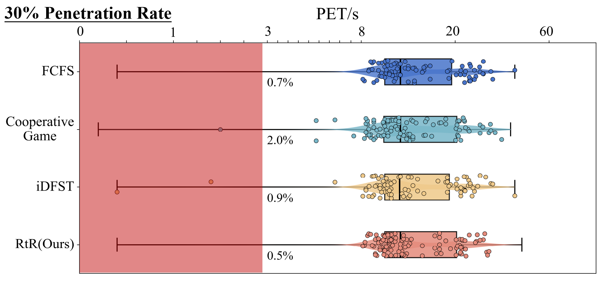
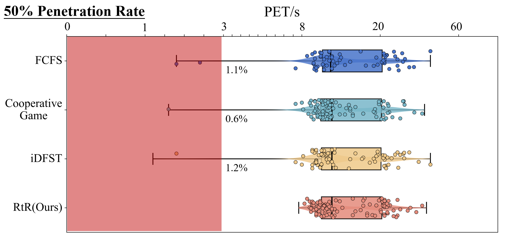
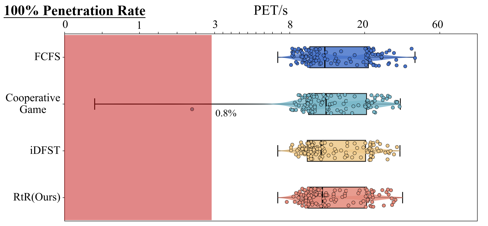

## Recognize then Resolve: A Hybrid Framework for Understanding Interaction and Cooperative Conflict Resolution in Mixed Traffic

## [Shiyu Fang](https://fangshiyuu.github.io/)

## Abstract
A lack of understanding of interactions and the inability to effectively resolve conflicts continue to impede the progress of Connected Autonomous Vehicles (CAVs) in their interactions with Human-Driven Vehicles (HDVs). To address this challenge, we propose the Recognize then Resolve (RtR) framework. First, a Bilateral Intention Progression Graph (BIPG) is constructed based on CAV-HDV interaction data to model the evolution of interactions and identify potential HDV intentions. Three typical interaction breakdown scenarios are then categorized, and key moments are defined for triggering cooperative conflict resolution. On this basis, a constrained Monte Carlo Tree Search (MCTS) algorithm is introduced to determine the optimal passage order while accommodating HDV intentions. Experimental results demonstrate that the proposed RtR framework outperforms other cooperative approaches in terms of safety and efficiency across various penetration rates, achieving results close to consistent cooperation while significantly reducing computational resources.

## Method Overview
To model the interaction process, identify the latent intentions of HDVs, and search for the optimal cooperative passing order, this paper proposes the RtR framework, as illustrated below. Initially, a BIPG is established to identify interaction breakdown and the intentions of HDVs. Additionally, the MCTS algorithm is utilized to determine the optimal passing order while ensuring the HDV intention constraints are met.

## Supplementary Experiments
It should be noted that this experiment is only a supplementary addition to the main body of the paper. For a complete experimental comparison, please refer to the original text.

#### A open intersection CAV-HDV interaction case

  <video muted controls width="500" style="margin-right: 10px;">
    <source src="./src/Takeover_case.mp4" type="video/mp4">
  </video>

#### PET analysis across various penetration rate
This section supplements the distribution of PET under different penetration rates. Since we have already conducted a detailed safety evaluation of each method at a 70% penetration rate in the main text, here we provide additional clarification on the performance of the models under other penetration rates. 

First, from the perspective of average PET, there is little difference among all methods, with each maintaining around 10 seconds, indicating that all four methods are capable of ensuring safety. However, from the minimum PET, the RtR framework proposed by us only experiences events with PET less than 3 seconds in scenarios with a low CAV penetration rate of 30%. No dangerous interactions were observed at other penetration rates. 

On the other hand, the methods based on retained FCFS and iDFST can only guarantee safety when the penetration rate reaches 100%. This aligns with the point mentioned in the main text, where such methods, being based on preset rules, have limited ability to respond to uncontrolled HDVs. Finally, the cooperative game theory approach, due to its optimization objective mainly focusing on reducing delays, introduces certain risks when overemphasizing efficiency in traffic flow.

